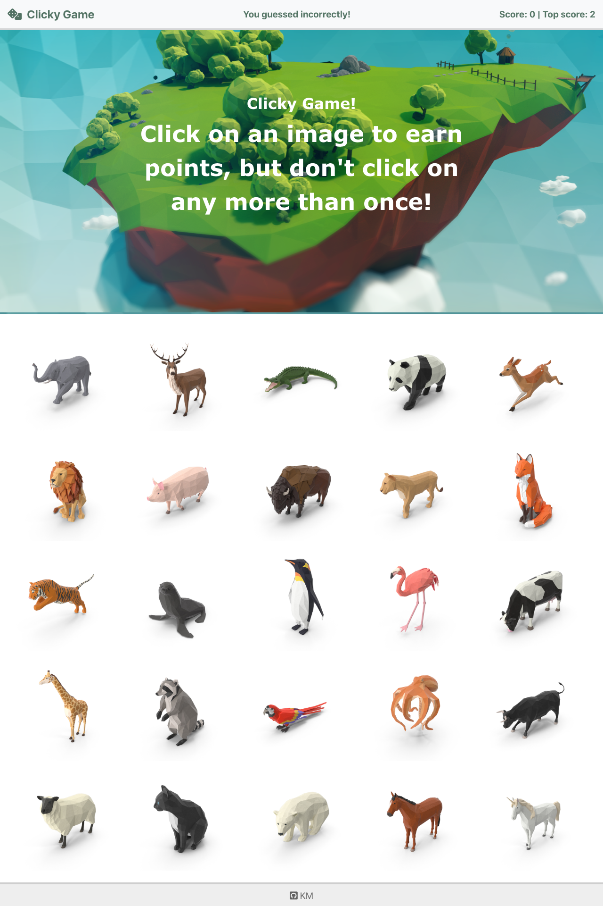

## Clicky Game

### Overview

A memory game with React.

- The application render different images to the screen. Each image listens for click events.

- The application keeps track of the user's score. The user's score increments when clicking an image for the first time. The user's score resets to 0 if they click the same image more than once.

- Every time an image is clicked, the images rendered to the page shuffle themselves in a random order.

- Once the user's score is reset after an incorrect guess, the game restarts.

## Tech:

- [React]
- [Bootstrap]

